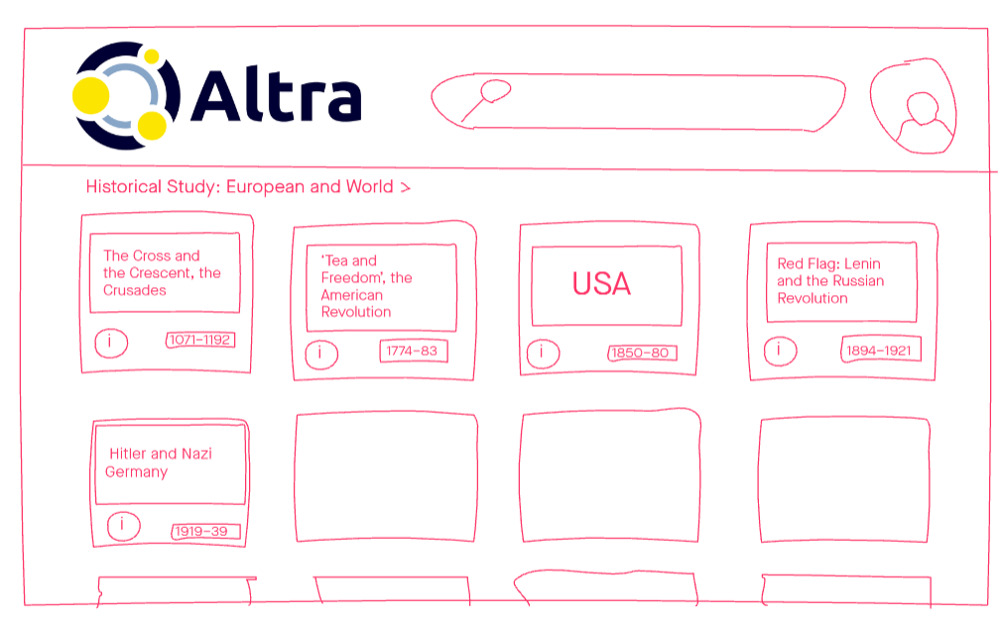
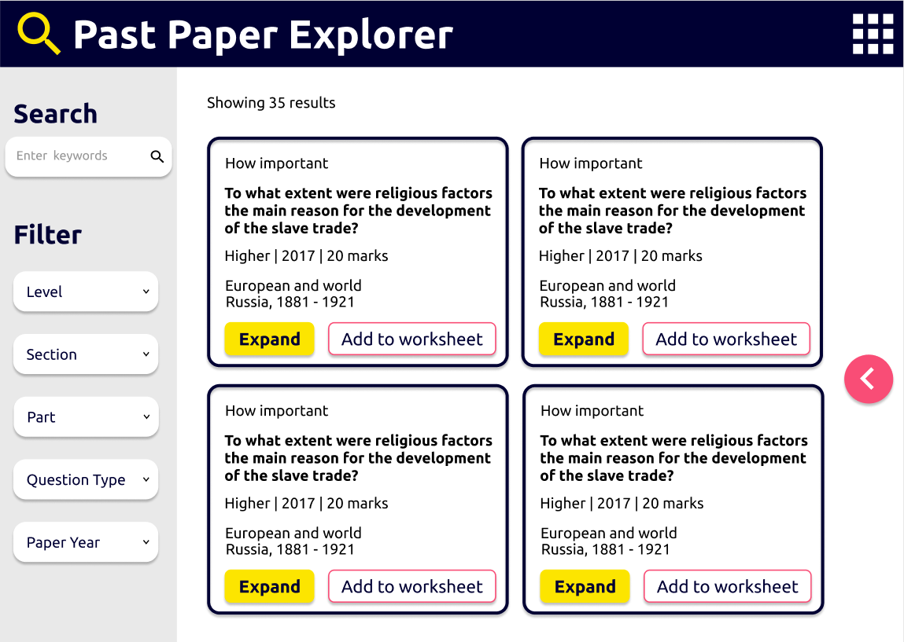
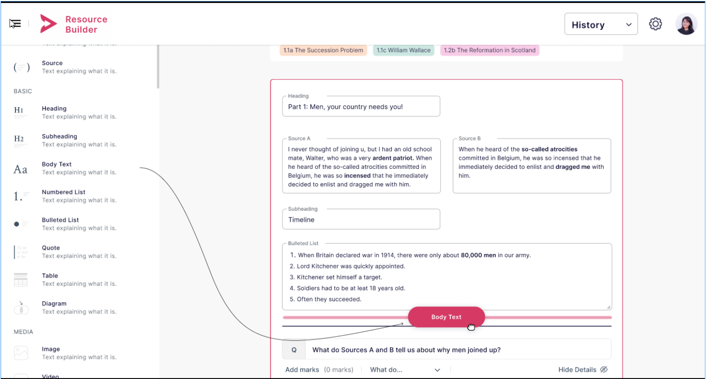
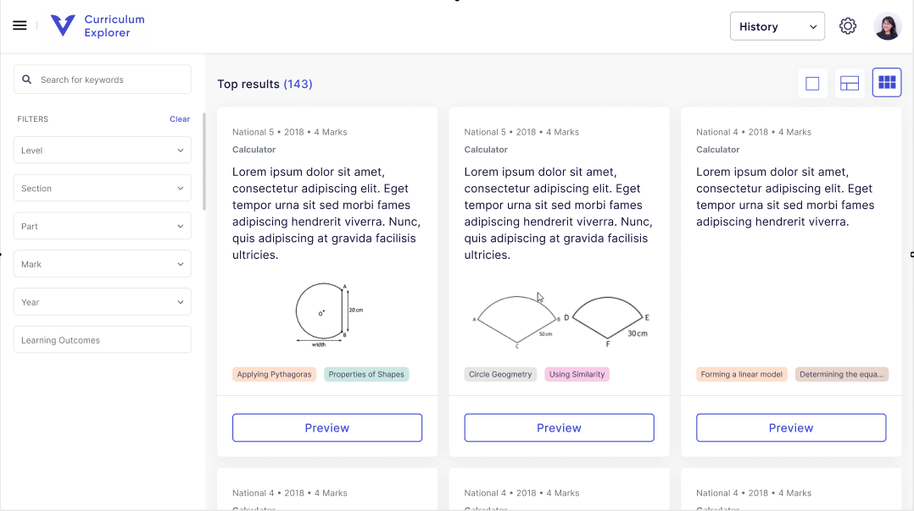

This was a project where we banded together with several University of Edinburgh students to create an EdTech start-up.
Our aim was to create software to help Scottish school teachers save time.
Through initial consultations and co-design with teacher volunteers from Facebook groups, we settled on a project idea -- Past Paper Explorer.

In Scotland, the Scottish Qualifications Authority (SQA) manage standardised exams for all schools at National 5, Higher, and Advanced Higher level.
Past exam papers are made available publicly in PDF format.
Teachers use past papers to create revision exercises for their pupils.
However, searching for keywords or topics or types of questions through individual PDFs is difficult.

We parsed and indexed the content of past papers in several subjects (initially history, social studies, life sciences, maths, physics).
This allowed users to easily find questions by subject, topic, year, or keyword.
Each question was also linked to the relevant marking scheme that the SQA also publish.

Building on this, we also started development on the Resource Builder -- another app for creating worksheets from past paper questions, allowing you to reuse and modify questions.
Unfortunately, due to other commitments and plans, we ceased work on the Altra Past Paper Explorer and Resource Builder.

It may yet still be revived sometime in the future.

Mock-up screenshots and links (to access Invision FreeHand board links, click "log in as guest" in the top right corner and enter any email address):
<table>
  <tbody>
  <tr>
    <td class="images">
      
    </td>
    <td class="images">
      
    </td>
  </tr>
  <tr>
    <td class="images">
      
    </td>
    <td class="images">
      
    </td>
  </tr>
  </tbody>
</table>