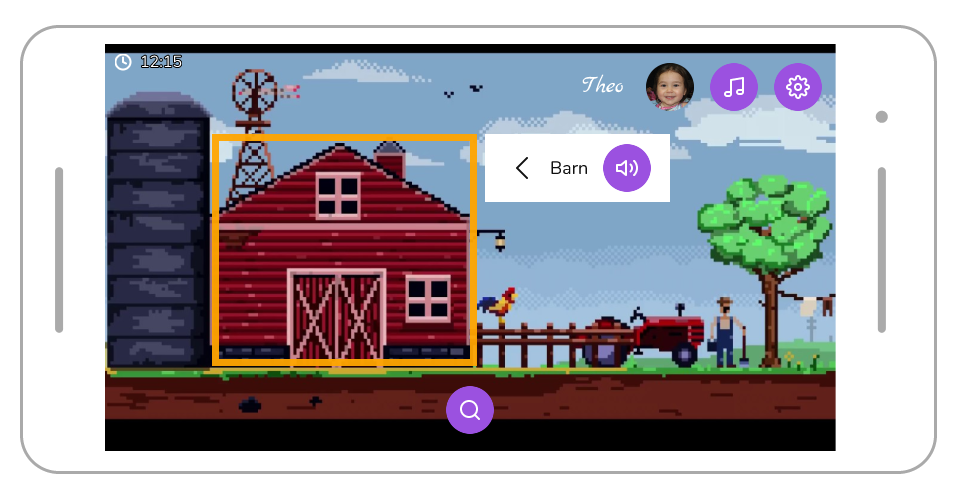
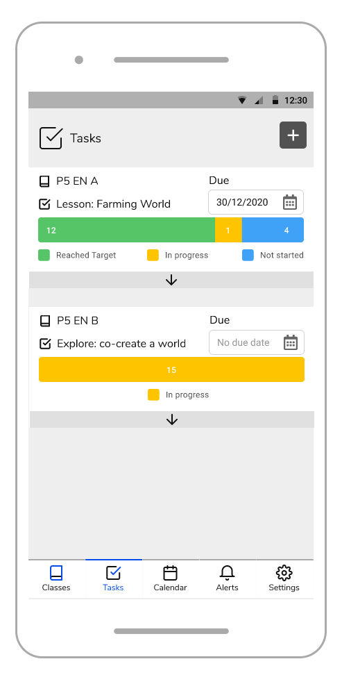

This project was about the design, implementation, and evaluation of “Fill In The World” – a gamified language learning application for primary school children. The game allows children to learn English vocabulary through creative and collaborative exploration, unlike any of the explored existing applications. Following usability evaluation, it was established that the game still needs to be improved and extended before it could be implemented in classrooms or used for research about the effectiveness of individual gamification elements.

Fill In The World is featured in the [List of 2020-21 outstanding informatics projects](https://project-archive.inf.ed.ac.uk/ug4/2021-outstanding.html).

Figma mock-up screenshots:
<table>
    <tbody><tr>
      <td style="height: 300px; overflow: hidden;">
        
      </td>
      <td style="height: 300px; overflow: hidden;">
        
      </td>
    </tr>
  </tbody>
</table>