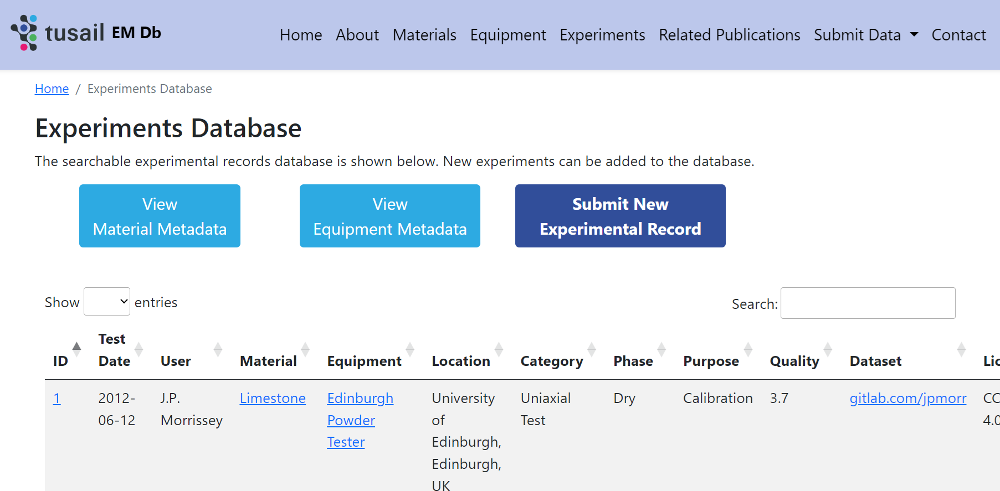
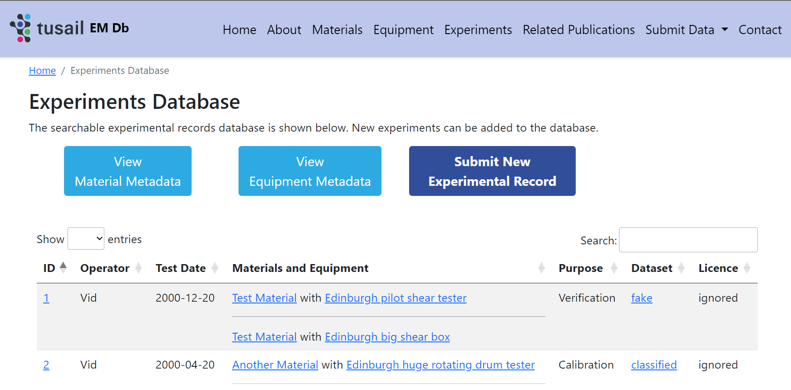
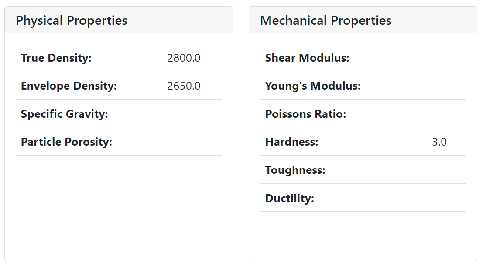
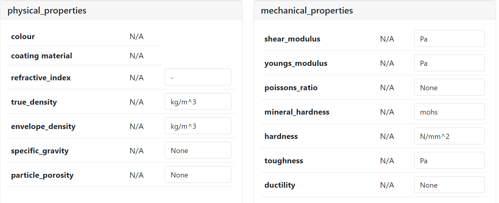

Prof. Jin Ooi, Chair of Particulate Solid Mechanics, Institute for Infrastructure and Environment, School of Engineering:
> “We have learnt much from [our intern's] knowledge and detailed review so far, which is also helpful for the new European project we are planning to submit this year which has a much larger ML database component.”

In spring and summer 2023, I worked on the TUSAIL Experimental Measurements Database project with Professor Jin Ooi and Dr John Morrissey from the School of Engineering. [Training in Upscaling particle Systems: Advancing Industry across Length-scales | TUSAIL](https://tusail.eu/) is an EU Horizon 2020 grant funded project about training early career researchers in engineering and sharing simulation tools and methodologies with industry partners. My internship was on a part of this larger project, focusing on aggregating metadata about experiments with engineering materials – the TUSAIL Experimental Measurements Database or “EMDB” for short.

Before I joined the team, Dr Morrissey had already created a prototype EMDB website, available here: [TUSAIL EM Db (jpmorr.eu.pythonanywhere.com)](https://jpmorr.eu.pythonanywhere.com/). This prototype was mostly complete from an end user’s perspective, but it was only suitable as a demo, running with an in-memory SQLite database backend which does not scale to support high internet traffic nor allows changes to be made easily after deployment. I spent the first few weeks researching different backend options until we decided to settle on PostgreSQL with part of the data stored in SQL columns and part in JSON blobs. Mixing the two approaches made development more complex but will hopefully allow the database to both perform well under high demand and make the schema relatively easy to change after deployment. I used SQL Alchemy to write the Object-Relational Model for PostgreSQL tables, which, in theory, would make switching to another SQL database like MariaDB trivial if required. The rest of my project was re-implementing the prototype website with the new backend and adding a few new features.

A summary of changes:
* Migrated from SQLite to PostgreSQL + JSON Schema
* Consolidated ~50 database tables into 8
* `176 files changed, 7083 insertions(+), 21199 deletions(-)`
* Reduced thousands of lines of code by extracting duplicated behaviour
* Minor additional features: min/max bounds checking, image support
* Public library contributions:
  * [Handle Enum columns backed by Python Enums by Vidminas · Pull Request #164 · kvesteri/wtforms-alchemy (github.com)](https://github.com/kvesteri/wtforms-alchemy/pull/164)
  * [How to apply custom validator to schemas that specify $schema? · Issue #1133 · python-jsonschema/jsonschema (github.com)](https://github.com/python-jsonschema/jsonschema/issues/1133)
  * [unevaluatedProperties error gets raised before more relevant validation errors · Issue #1132 · python-jsonschema/jsonschema (github.com)](https://github.com/python-jsonschema/jsonschema/issues/1132)

Most results are difficult to showcase with screenshots because the user interface looks the same, it’s how data is delivered to the interface that was completely overhauled. However, some of the new features are visible, for example, I extended the experiment schema to allow recording experiments with more than one material and/or equipment and updated the user interface to surface this information:

| Before | After |
|--|--|
|  |  |

Another new feature was making the units of measurements explicit and allowing users to convert between units on the website:

| Before | After |
|--|--|
|  |  |

Throughout the project, we had to make lots of design decisions. Frequent communication with the team (weekly meetings and/or catch-up emails) helped me keep making steady progress without getting blocked.

With a broad scope of initial tasks, there are still plenty of unfinished things left to do in the project. I didn’t have time to polish the user interface layout, test changes extensively, nor implement all the desired new features. At the project midpoint and in the second last week, we discussed priorities with the team, and I focused my time on the bits that would be most challenging for them to complete by themselves after the handover. I made comprehensive notes throughout the project, including a handover summary at the end, including what I did, what is still left to do, and some tips and things to watch out for when developing the EMDB further.

During this internship, I worked on a wide range of tasks – from design and accessibility considerations in the user interface to researching pros/cons of different databases to re-implementing backend services for an existing application to contributing to open-source libraries. Although I had done all these things in my work before, I had only superficial prior experience with databases, and learned a lot through the initial research phase. Working with JSON Schema during the implementation phase was an interesting follow-up to an internship I undertook with Esri Inc. in 2018, where I developed a YAML language server that also used JSON schema – back then, I only needed to learn the basics, and knew enough to propose this as a viable option for the EMDB, but I ended up learning it a lot more thoroughly in this project. I think this experience will be useful going forward, as it makes me more qualified as a full-stack developer and is indirectly relevant for my PhD work, because I will need to develop several prototype applications of search for educators.

Besides technical skills, I enjoyed the opportunity to network outside of the School of Informatics. The team I worked with were friendly and helpful, and I think I might consider working with them again in the future. Although it is past the internship contract date, we have planned a final meeting in August, when the host team are back from annual leave – it will be nice to meet in-person to wrap up.

Overall, I think the DRS Ambassadors scheme was very well organised and I would recommend it for those looking to build up some work experience. It requires applicants to be flexible about what they do, and I would not recommend it for those who have a fixed idea of what they want to work on. It’s a good way to meet people from other parts of the university, and therefore great for those in earlier stages of their studies or those intending to stay at the university after studies.