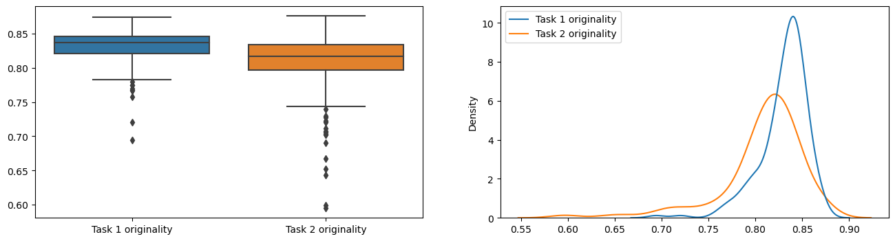
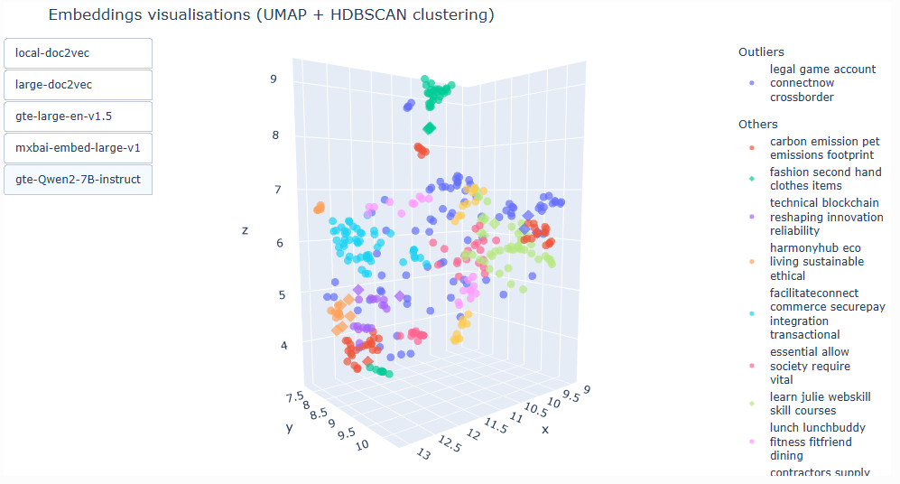

As a Digital Research Services Ambassador in 2024, I worked with a team in the University of Edinburgh Business School on a study of how students used ChatGPT in a coursework exercise.

Students on the Digital Business course (n=192) were asked to write business proposals for a competition in which the most original proposal would win. They first wrote proposals without generative AI, then refined them using ChatGPT. The project host wanted to know whether human-written or AI-assisted proposals were more original.

My role was to work out how to measure that. We defined the originality of a proposal as the inverse of its similarity to all the other proposals. Over the course of the project both I and the hosts learned a good deal about text similarity: we tried orthographic (character-level) similarity, sequence (string) similarity, and cosine similarity using both static and contextual embeddings. We settled on an average of several similarity measures, averaging in turn between cosine distance to all other proposals and to the ten closest proposals within the same task.

A summary of findings:
* Task 1 texts (without ChatGPT) were distinctly dissimilar from task 2 texts (with ChatGPT), except for the pairs written by the same student
* There was a statistically significant (Wilcoxon signed-rank test, p < 1e-9) but small difference in originality between tasks, implying no real-world noticeable difference between student-written and ChatGPT-refined proposals
* Most proposals had moderate originality, with only a few outliers standing out as less original
* A short passage of mock irrelevant data was clustered together with submissions that were not really legitimate business proposals -- distance to mock data could potentially be a way to measure appropriateness

In an extension to the project, I experimented with dimensionality reduction and clustering to identify groups of similar proposals. UMAP and HDBSCAN with C-TF-IDF topic keywords gave the most interesting visualisation, with recurring clusters around carbon emissions and transportation, clothing and fashion, tutoring and learning, and secure payments:

As the project involved student data, all texts were pseudonymised and had to stay on university services. I started out with [Noteable](https://noteable.edina.ac.uk/) notebooks, and moved to the Informatics research cluster for training the larger Doc2Vec model and computing embeddings with large models. At the end of the project, I handed over a spreadsheet with similarity and originality scores for all texts, code and instructions to reproduce them, and a notebook with statistical analysis and interactive visualisations.

My analysis will form part of a larger project, ["Generative AI and creativity: An experiment to investigate AI uses for problem-solving and respective outcomes"](https://web.archive.org/web/20260427100628/https://institute-academic-development.ed.ac.uk/learning-teaching/funding/funding/previous-projects/year/oct-23/generative-AI-in-education), involving human marker annotation of originality, appropriateness, and types of interactions with ChatGPT. As my originality metric choices were mostly based on benchmark evaluations and correlations between scores without any source of ground-truth, I am very curious how it will compare to human-labelled originality scores.

There wasn't much code to write, but lots of conceptual thinking to do. It would have been easy to just pick any distance metric and present it as our originality score, but this would have been far less interesting than investigating the whole variety of available options.
